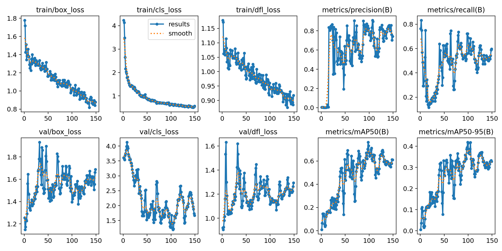

# Aircraft Stand Monitoring
This project aims to develop a system that monitors the aircraft stand area to ensure there are no vehicles present before the aircraft's departure. The system uses video analysis, polygon boundaries, and time intervals to detect and notify the ground handler if any vehicles are within the stand boundaries.

## - Metrics

- train/box_loss: Training loss for bounding box regression.
- train/cls_loss: Training loss for class prediction.
- train/dfl_loss: Training loss for deformable convolutional networks.
- metrics/precision(B): Precision of predictions, indicating the ratio of true positive predictions.
- metrics/recall(B): Recall of predictions, indicating the ratio of true positive predictions to all actual positives.
- metrics/mAP50(B): Mean Average Precision at 50% intersection over union.
- metrics/mAP50-95(B): Mean Average Precision from 50% to 95% intersection over union.
- val/box_loss: Validation loss for bounding box regression.
- val/cls_loss: Validation loss for class prediction.
- val/dfl_loss: Validation loss for deformable convolutional networks.
- lr/pg0: Learning rate for the first parameter group.
- lr/pg1: Learning rate for the second parameter group.
- lr/pg2: Learning rate for the third parameter group.

I trained the YOLOv8 model for 100 epochs with the nano model, indicating that there's significant untapped potential for accuracy improvement. The focal point of assessment lies in the mAP50-95 metric, signaling stability in detection.
The current mAP50-95 stands at 0.4, emphasizing that this is not the final accuracy level. The graphs illustrate the model's ongoing learning trajectory.

##  Approach and Limitations
To address box prediction instability, I opted for a pragmatic approach. Detection is triggered when the midpoint of the bounding box touches our Region of Interest (ROI). This choice simplifies detection, focusing on vehicles that directly enter the ROI.

### Advantages:

- Simplifies detection logic.
- Concentrates on vehicles directly entering the ROI.
### Limitations:

- Stability concerns in box predictions.
- Further refinement needed for enhanced accuracy.
- This pragmatic approach streamlines the detection process, providing a balance between precision and practicality.

# Model Choice and Technologies
## Ultralytics (YOLOv8)
I chose Ultralytics, specifically YOLOv8, as the primary model for its convenience in model training and deployment. Key reasons include:

- Ease of Use: Ultralytics YOLOv8 simplifies the model training process, providing a straightforward workflow for both beginners and experienced practitioners.

- Good Out-of-the-Box Accuracy: YOLOv8 offers a commendable level of accuracy without extensive fine-tuning. This is particularly beneficial for quick prototyping and initial model evaluation.

- Synthetic Dataset Support: YOLOv8 is well-suited for processing synthetic datasets. It accommodates the use of larger models to generate markup efficiently, making it versatile for various training scenarios.

## OpenCV
- Classic OpenCV is incorporated into the project for its versatility and ease of use in video processing tasks. OpenCV provides a comprehensive set of tools for image and video manipulation, making it a natural choice for this project.

## Shapely
Shapely is utilized for geometric operations, particularly in defining and working with polygons. Key features include:

- Polygon Manipulation: Shapely simplifies the manipulation of polygons, allowing for easy creation, modification, and analysis.

- Geometric Operations: It provides a rich set of geometric operations such as intersection, union, and containment, which are crucial for tasks involving region-of-interest (ROI) analysis.

- Integration with OpenCV: Shapely seamlessly integrates with OpenCV, enhancing the overall capabilities for handling complex spatial relationships in the project.

- The combination of Ultralytics YOLOv8, OpenCV, and Shapely offers a robust and efficient solution for the aircraft stand monitoring system.

# How to setup

Run the Python script: Initiates the execution of the Python script named main.py.

-video_folder: Command-line argument for specifying the video folder. It takes the value of $VIDEO_FOLDER.

-polygon_path: Command-line argument for specifying the path to the JSON file with stand boundaries. It takes the value of $POLYGON_PATH.

-output_folder: Command-line argument for specifying the output folder. It takes the value of $OUTPUT_FOLDER.

-yolo_model_path: Command-line argument for specifying the path to the YOLO model. It takes the value of $YOLO_MODEL_PATH.

